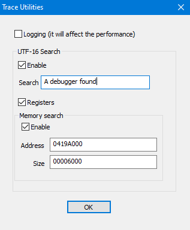

# TraceUtilities

Created from [PluginTemplate](https://github.com/x64dbg/PluginTemplate)

## Features

- UTF-16 search on registers and memory


## TODO

- UTF-8 support

## Building

From a Visual Studio command prompt:

```
cmake -B build64 -A x64
cmake --build build64 --config Release
```

You will get `build64\TraceUtilites.sln` that you can open in Visual Studio.

To build a 32-bit plugin:

```
cmake -B build32 -A Win32
cmake --build build32 --config Release
```

Alternatively you can open this folder in Visual Studio/CLion/Qt Creator.


## Automatic reloading

You can set up the [PluginDevHelper](https://github.com/x64dbg/PluginDevHelper) utility to automatically unload and reload the plugin from x64dbg when compiling. See the README there for more detailled instructions.
